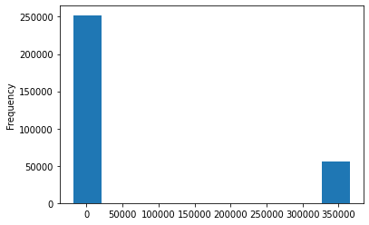
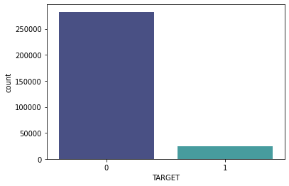

.. code:: ipython3

    import pandas as pd
    import matplotlib.pyplot as plt
    import numpy as np
    from numpy import loadtxt
    import seaborn as sns

Load data
=========

.. code:: ipython3

    application_train = pd.read_csv('application_train.csv')
    application_test = pd.read_csv('application_test.csv')

.. code:: ipython3

    print("Shape of the train : ", application_train.shape)
    print("Shape of the test : ", application_test.shape)

.. parsed-literal::

    Shape of the train :  (307511, 122)
    Shape of the test :  (48744, 121)

Exploring data
==============

.. code:: ipython3

    #application_train.describe()

.. code:: ipython3

    application_train['DAYS_EMPLOYED'].plot.hist()

.. parsed-literal::

    <AxesSubplot:ylabel='Frequency'>

.. code:: ipython3

    application_train['DAYS_EMPLOYED'].replace({365243 : np.nan}, inplace = True)

.. code:: ipython3

    application_train['DAYS_EMPLOYED'].describe()

.. parsed-literal::

    count    252137.000000
    mean      -2384.169325
    std        2338.360162
    min      -17912.000000
    25%       -3175.000000
    50%       -1648.000000
    75%        -767.000000
    max           0.000000
    Name: DAYS_EMPLOYED, dtype: float64

Distribution of target
~~~~~~~~~~~~~~~~~~~~~~

.. code:: ipython3

    sns.countplot(data=application_train, x='TARGET', palette='mako')

.. parsed-literal::

    <AxesSubplot:xlabel='TARGET', ylabel='count'>

Distribution of missing values
~~~~~~~~~~~~~~~~~~~~~~~~~~~~~~

.. code:: ipython3

    df_missing_values  = pd.DataFrame(round((application_train.isnull().sum().sort_values(ascending=False)/application_train.shape[0])*100,1)).reset_index()
    df_missing_values .columns = ['Columns', '% of Missing Data']
    df_missing_values .style.format({'% of Missing Data': lambda x:'{:.1%}'.format(abs(x))})
    cm = sns.light_palette("red", as_cmap=True)
    #df_missing_values.style.background_gradient(cmap=cm)
    df_missing_values

.. raw:: html

    

    
    <table border="1" class="dataframe">
      <thead>
        <tr style="text-align: right;">
          <th></th>
          <th>Columns</th>
          <th>% of Missing Data</th>
        </tr>
      </thead>
      <tbody>
        <tr>
          <th>0</th>
          <td>COMMONAREA_AVG</td>
          <td>69.9</td>
        </tr>
        <tr>
          <th>1</th>
          <td>COMMONAREA_MODE</td>
          <td>69.9</td>
        </tr>
        <tr>
          <th>2</th>
          <td>COMMONAREA_MEDI</td>
          <td>69.9</td>
        </tr>
        <tr>
          <th>3</th>
          <td>NONLIVINGAPARTMENTS_AVG</td>
          <td>69.4</td>
        </tr>
        <tr>
          <th>4</th>
          <td>NONLIVINGAPARTMENTS_MEDI</td>
          <td>69.4</td>
        </tr>
        <tr>
          <th>...</th>
          <td>...</td>
          <td>...</td>
        </tr>
        <tr>
          <th>117</th>
          <td>REG_CITY_NOT_LIVE_CITY</td>
          <td>0.0</td>
        </tr>
        <tr>
          <th>118</th>
          <td>LIVE_REGION_NOT_WORK_REGION</td>
          <td>0.0</td>
        </tr>
        <tr>
          <th>119</th>
          <td>REG_REGION_NOT_WORK_REGION</td>
          <td>0.0</td>
        </tr>
        <tr>
          <th>120</th>
          <td>REG_REGION_NOT_LIVE_REGION</td>
          <td>0.0</td>
        </tr>
        <tr>
          <th>121</th>
          <td>SK_ID_CURR</td>
          <td>0.0</td>
        </tr>
      </tbody>
    </table>
    
122 rows × 2 columns

    

Type of columns
~~~~~~~~~~~~~~~

.. code:: ipython3

    application_train.dtypes.value_counts()

.. parsed-literal::

    float64    66
    int64      40
    object     16
    dtype: int64

Deleting columns where data is missing for qualitative variable
~~~~~~~~~~~~~~~~~~~~~~~~~~~~~~~~~~~~~~~~~~~~~~~~~~~~~~~~~~~~~~~

.. code:: ipython3

    df_object_missing_values  = pd.DataFrame(round((application_train.select_dtypes('object').isnull().sum().sort_values(ascending=False)/application_train.select_dtypes('object').shape[0])*100,1)).reset_index()
    df_object_missing_values.columns = ['Columns', '% of Missing Data']
    df_object_missing_values.style.format({'% of Missing Data': lambda x:'{:.1%}'.format(abs(x))})
    cm = sns.light_palette("red", as_cmap=True)
    #df_object_missing_values.style.background_gradient(cmap=cm)
    df_object_missing_values

.. raw:: html

    

    
    <table border="1" class="dataframe">
      <thead>
        <tr style="text-align: right;">
          <th></th>
          <th>Columns</th>
          <th>% of Missing Data</th>
        </tr>
      </thead>
      <tbody>
        <tr>
          <th>0</th>
          <td>FONDKAPREMONT_MODE</td>
          <td>68.4</td>
        </tr>
        <tr>
          <th>1</th>
          <td>WALLSMATERIAL_MODE</td>
          <td>50.8</td>
        </tr>
        <tr>
          <th>2</th>
          <td>HOUSETYPE_MODE</td>
          <td>50.2</td>
        </tr>
        <tr>
          <th>3</th>
          <td>EMERGENCYSTATE_MODE</td>
          <td>47.4</td>
        </tr>
        <tr>
          <th>4</th>
          <td>OCCUPATION_TYPE</td>
          <td>31.3</td>
        </tr>
        <tr>
          <th>5</th>
          <td>NAME_TYPE_SUITE</td>
          <td>0.4</td>
        </tr>
        <tr>
          <th>6</th>
          <td>ORGANIZATION_TYPE</td>
          <td>0.0</td>
        </tr>
        <tr>
          <th>7</th>
          <td>WEEKDAY_APPR_PROCESS_START</td>
          <td>0.0</td>
        </tr>
        <tr>
          <th>8</th>
          <td>NAME_HOUSING_TYPE</td>
          <td>0.0</td>
        </tr>
        <tr>
          <th>9</th>
          <td>NAME_FAMILY_STATUS</td>
          <td>0.0</td>
        </tr>
        <tr>
          <th>10</th>
          <td>NAME_EDUCATION_TYPE</td>
          <td>0.0</td>
        </tr>
        <tr>
          <th>11</th>
          <td>NAME_INCOME_TYPE</td>
          <td>0.0</td>
        </tr>
        <tr>
          <th>12</th>
          <td>FLAG_OWN_REALTY</td>
          <td>0.0</td>
        </tr>
        <tr>
          <th>13</th>
          <td>FLAG_OWN_CAR</td>
          <td>0.0</td>
        </tr>
        <tr>
          <th>14</th>
          <td>CODE_GENDER</td>
          <td>0.0</td>
        </tr>
        <tr>
          <th>15</th>
          <td>NAME_CONTRACT_TYPE</td>
          <td>0.0</td>
        </tr>
      </tbody>
    </table>
    

.. code:: ipython3

    application_train.select_dtypes('object').apply(pd.Series.nunique, axis = 0)

.. parsed-literal::

    NAME_CONTRACT_TYPE             2
    CODE_GENDER                    3
    FLAG_OWN_CAR                   2
    FLAG_OWN_REALTY                2
    NAME_TYPE_SUITE                7
    NAME_INCOME_TYPE               8
    NAME_EDUCATION_TYPE            5
    NAME_FAMILY_STATUS             6
    NAME_HOUSING_TYPE              6
    OCCUPATION_TYPE               18
    WEEKDAY_APPR_PROCESS_START     7
    ORGANIZATION_TYPE             58
    FONDKAPREMONT_MODE             4
    HOUSETYPE_MODE                 3
    WALLSMATERIAL_MODE             7
    EMERGENCYSTATE_MODE            2
    dtype: int64

.. code:: ipython3

    application_train.drop(columns=['FONDKAPREMONT_MODE','WALLSMATERIAL_MODE','HOUSETYPE_MODE','EMERGENCYSTATE_MODE',
                                   'OCCUPATION_TYPE','NAME_TYPE_SUITE'],inplace=True)
    print('Shape of the train :', application_train.shape)

.. parsed-literal::

    Shape of the train : (307511, 116)

.. code:: ipython3

    application_train.to_csv('application_clean_train.csv')
